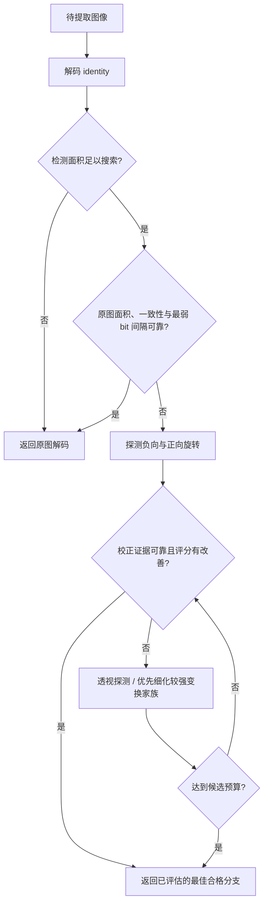

# Budget-WAM：由解码证据驱动的预算几何同步

本轮把[项目深度评估](RESEARCH_DEPTH_AUDIT.md)的首选方向实现为 `budget_wam`。
研究问题是：取消对攻击填充颜色的门控依赖后，能否在控制候选调用次数的同时，
保留完整几何搜索的恢复收益？实现与实验独立编号为 `geometry-v3`。

独立测试见[结果报告](GEOMETRY_V3_RESULTS.md)，工程与真实前后端验证见
[验收记录](GEOMETRY_V3_ACCEPTANCE.md)。

## 1. 贡献位置

底层编码器、空间检测器和消息解码器沿用官方 WAM；内容自适应、质量反馈嵌入沿用
M4.1。本轮新增的是**推理策略与其独立验证**，没有训练新神经网络，不声称首创
几何校正、置信度门控或提前退出。组合策略是否有价值，由统一输入、配对结果、
负样本和实际计时共同判断。

原 AM-WAM 根据边角接近中值色的面积决定是否搜索，容易跳过黑色、反射和裁边
输入。新策略不读取边框颜色，不接收攻击名称、真实角度、填充类型、数据集标签或
预期消息。运行时唯一输入是待提取图像，分支选择仅使用 WAM 输出证据。
这减少了对填充的直接依赖；候选变换和底层模型仍可能有分布偏好，不能称为
“完全与攻击类型无关”或“对任意几何变换鲁棒”。

## 2. 顺序决策

代码入口：`src/watermark_lab/innovations/budget_geometry.py`。
`run_budget_policy(fetch, config)` 是在线推理与轨迹重放共用的纯决策函数；
`fetch` 仅在策略要求时才构造校正图并调用模型。



每个候选保留：检测区域占比、平均检测置信度、空间消息一致性、32 bit 平均
logit、最弱 bit 与平均 bit 判决间隔、原几何评分。最弱 bit 间隔定义为各 bit
平均 logit 到判决阈值 0.5 的最小绝对距离；它是停止的证据，不是正确率概率。

候选全集固定为 10 个：identity；旋转 ±3°、±6°、±10°；透视幅度 0.03、0.06、
0.10。先探测 −6°、+6°、透视 0.06，再根据已见分支的评分优先细化其家族。
至少评估两个旋转方向后，才允许校正分支提前停止；identity 可以直接结束。
所有步骤都计入预算，包含 identity。候选面积不足时不能凭较高评分接管输出。
若无合格改善，最终回退 identity。

输出定位图回投影到输入图像坐标，保留检测器网格分辨率；它表示水印存在区域，
不是篡改掩码。单图 API 同时返回执行顺序、候选数、预算、停止原因、选中变换和
冻结检测阈值，结果页展示该轨迹。

## 3. 预设实验与数据隔离

协议：`configs/geometry_v3_protocol.yaml`；策略搜索范围：
`configs/geometry_v3_policy_search.yaml`。种子固定为 20260906。

| 用途 | 图像数 | 来源与约束 |
|---|---:|---|
| development | 12 | 旧 Debug 数据每源 3 图，只用于开发 |
| calibration | 48 | 四数据源各 12 张新图，仅此集合选择阈值与预算 |
| test | 80 | 四数据源各 20 张新图，策略文件冻结后才运行 |

COCO、DIV2K、DiffusionDB、W-Bench 的新图按文件名和 SHA-256 排除项目旧清单，
并校验新 calibration/test 互不重复。来源 revision 和排除清单保存在
`configs/geometry_v3_sources.json`，每次运行还核验实际文件及官方权重的 SHA-256。
DIV2K validation 已被旧实验用尽，本轮从未使用的 train 源文件选择；这里的
“未见”仅指项目实验历史，**不承诺与 WAM 的预训练数据隔离**。原始与带水印图
使用相同 test 图像，负样本在嵌入前提取；正负结果不作为独立图像重复计算。

所有图像在嵌入前等比缩到最长边不超过 1024。固定 WAM 强度在新 calibration
上分数据源重新匹配平均 PSNR 约 40 dB；自适应嵌入沿用 M4 质量反馈参数。
原 formal-v1 为另一分辨率和攻击分布，本轮结果不并入其排名。

16 项正样本条件：无攻击、JPEG50、半径 4 模糊、σ=0.01 噪声；中值、黑色、
反射、裁边缩放各 −12.7° 与 +8.3°；两项旋转后 JPEG70；幅度 0.08 透视和
一项非对称四点透视。4 项负样本条件：无攻击、JPEG50、黑色 +8.3°、反射 +8.3°。
旋转角度均不等于校正候选；透视族依然有限，不覆盖所有真实拍摄过程。

| 对照 | 嵌入 | 解码 | 用途 |
|---|---|---|---|
| B0 `wam_fixed` | 分数据源固定强度 | identity | 原始模型基线 |
| B1 `adaptive_identity` | 质量反馈自适应 | identity | 嵌入控制作用 |
| `legacy_am` | 同 B1 | 原边框门控 + 完整搜索 + 融合 | 直接对比旧同步策略 |
| B2 `full_best` | 同 B1 | 无边框门控 + 10 候选最佳分支 | 几何校正参考 |
| B3 `full_soft` | 同 B1 | 无边框门控 + 10 候选软融合 | 融合作用 |
| B4 `budget_wam` | 同 B1 | 新预算策略 | 提前停止与证据门控作用 |

B1–B4 与旧门控对照共享逐像素相同的嵌入图与攻击图。旧 AM 对照使用本轮已修复
定位与空分支融合的实现，仅保留原门控和搜索规则；不能视为重跑了旧 formal-v1。

## 4. 校准、统计和时间

432 组预设策略仅在 48 张 calibration 上重放。通过条件是相对 B2 的完整恢复率
下降不超过 3 个百分点、平均候选调用不超过 7。每个方法的检测阈值独立设为
calibration 负样本最大区域占比的下一个可表示浮点数，因而在这些负样本上无误报。
这不是总体零误报保证，也没有附带预设 TPR 保证；TPR 必须单独报告。

在满足恢复和成本条件的策略中先选平均调用最少者，再选恢复较高者。如果没有
可行解，按预定规则从满足成本者中选恢复最高者，并标记目标未达标。选择文件
包含协议、策略源码、分析源码、搜索范围及 calibration 轨迹 SHA-256。
test provenance 一旦建立，脚本拒绝重选策略。

首次校准得到的冻结参数为：预算 7、最低搜索面积 0.01、可靠面积 0.25、原图最弱
bit 间隔 4.0、校正停止间隔 2.0、一致性 0.90、评分增益 0.006；检测区域阈值为
0.024291992187500003。calibration 完整恢复 88.28125%，B2 为 91.27604%，
差值 −2.99479 pp；平均调用 3.91536 次，负图 0/48 观察误报。该策略仅达到
校准点估计目标，不能把这些数字当作独立 test 结论。

按同图、同攻击配对报告救回、退化、恢复率差值；95% 区间使用 2,000 次按数据集
分层、以图像为单位的 Bootstrap，同图的多种攻击一同重采样。分家族、分数据集
比较属于探索性切片，没有多重比较校正。点估计在 −3 pp 以上不等于区间下界也
在 −3 pp 以上；报告分别显示点估计目标和统计非劣支持情况。

负样本误报同时保留条件级 FPR 和“每图 4 条条件任一误报”的图像计数，Wilson
区间以后者的 80 图为样本量，不将 320 条相关攻击当作 320 张独立图。该规模不足
以验证 0.1% 误报。

完整轨迹的候选耗时之和仅用于诊断，不当作线上速度。实际在线计时固定 test
每数据源前 3 张，共 12 图 × 4 条攻击 × 2 轮，对照 B1、旧 AM、B2、B4。GPU
暖机、CUDA 同步、交替方法顺序；每次输出逐位核对重放结果，并核对嵌入和攻击
图像哈希，B4 额外核对候选数。报告均值、p50、p95、候选数和进程显存峰值。
这些分位数对应这个小型计时子集，不等于全 80 图 × 16 攻击的耗时分布。

## 5. 复现入口

在仓库根目录 PowerShell 中依次执行；采集和计时使用 WAM GPU 环境，分析使用
现有统计环境。以下为复用仓库冻结策略的复现流程。脚本可复用同一来源指纹的
已完成图像；源码或配置改变时拒绝混用。

```powershell
.\.venv-trustmark\Scripts\python.exe scripts/prepare_geometry_v3_data.py
.\.venv-wam-gpu\Scripts\python.exe scripts/collect_geometry_v3.py --split calibration
.\.venv-trustmark\Scripts\python.exe scripts/analyze_geometry_v3.py --split calibration
.\.venv-wam-gpu\Scripts\python.exe scripts/collect_geometry_v3.py --split test
.\.venv-trustmark\Scripts\python.exe scripts/analyze_geometry_v3.py --split test
.\.venv-wam-gpu\Scripts\python.exe scripts/time_geometry_v3.py
.\.venv-trustmark\Scripts\python.exe scripts/export_geometry_v3.py
.\.venv-trustmark\Scripts\python.exe scripts/report_geometry_v3.py
```

首次建立本轮策略时，calibration 分析曾加 `--select`；已有冻结策略的复现不应
重新选参，也不能用重新采集的耗时覆盖原轨迹摘要。已完成 test 的工作目录不允许
再次执行策略选择。源码摘要按文件实际字节计算，须保留冻结时的行尾格式；完整
来源字节另存于每个 split 的 `source_snapshot/`，不能为消除哈希错误改写证据。
仓库 `.gitattributes` 对冻结的策略源码、协议、配置和 calibration/test 清单设置
`-text`，使启用 `core.autocrlf=true` 的 Windows 检出仍保留这些文件的原始字节；
不要对这些路径执行行尾标准化或自动格式化。
完整轨迹在 `results/geometry_v3/`，便携证据快照在
`docs/evidence/geometry_v3.json`。Web 的 `/api/research/geometry-v3` 及
`/api/research/geometry-v3/export.json` 只读该快照，缺失或损坏时显式返回 503。
本轮新模型在 API 中使用 `budget_wam`，沿用独立嵌入、提取和单图实验接口。
交互攻击追加 `rotate_black`、`rotate_reflect`、`rotate_crop_resize`，角度步长
0.1°；生产辅助函数通过逐像素测试与冻结实验变换对齐。SSIM 的 API 范围已修正
为 [−1, 1]，避免强破坏后的合法负 SSIM 导致实验保存失败。
